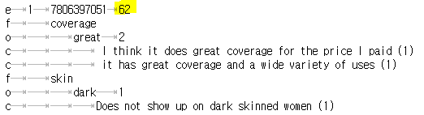
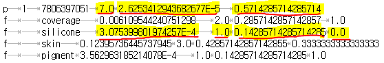

# Sentires: A Toolkit for Phrase-level Sentiment Analysis

## Introduction

This is a package for phrase-level sentiment analysis [5], it can extract **feature|opinion|sentiment** triplets to construct a context-sensitive sentiment lexicon from free-text corpus such as customer reviews in e-commerce and tweets/messages in social networks.

For exmple, in the customer reviews of the mobile phone product domain, some example triplets include "picture|clear|positive", "battery life|short|negative", "quality|high|positive", or "noise|high|negative". For the triplet "quality|high|positive", it means when the opinion word "high" is used to describe the feature word "quality," the feature-opinion pair presents a positive sentiment. 

The task is challenging since in many cases the sentiment is context-aware, e.g., for the same opinion word "high," when it is used to describe the feature word "quality" (i.e., quality|high), it presents a positive sentiment, however, when it is used to describe the feature word "noise" (i.e., noise|high), it instead presents a negative sentiment.

The package further contains a module that is capable of matching the triplets contained in a sentence or a paragraph. Some techniques of this toolkit are presented in papers [1,5]. Extracting feature-opinion pairs and their sentiments from text corpora is very helpful to many tasks, e.g., they help to develop explainable recommendatioin models [1,2,3,4,7,8], analyze customer and/or public opinions [5], and build conversational AI systems [6].

The executable jar balls are provided in two versions, one for processing [English](https://github.com/evison/Sentires/tree/main/English) texts, and the other for  processing [Chinese](https://github.com/evison/Sentires/tree/main/Chinese) texts. Instructions of using the package are provided in the following.

## Instruction

The toolkit builds a lexicon based on 6 steps (corresponding to 6 tasks), the 6 steps should be executed one by one in the correct order:

- **Step 1**. "pre" task: it conducts some pre-processing over your input data, such as removing sentences that are too short or grammatically incorrect. It takes the ".raw" file as input and outputs a “.select” file.

- **Step 2**. "pos" task: it conducts part of speech tagging based on Stanford tagger. It takes a ".select" file as input and outputs a ".seg" file.

- **Step 3**. "validate" task: it refines the part-of-speech tagging results, to generate a POS tagging file better suited for feature-opinion extraction. It takes the above ".seg" file as input, and generate another ".seg" file. To distinguish them, you may take a look at the .seg file. The Stanford POS taggers have at least 2 characters (e.g., /NN, /RB, /VBD, etc.), while in the refined .seg file each tagger only has one character (e.g., /N, /V, /P, /X, etc.).

- **Step 4**. "lexicon" task: it extracts the feature-opinion pairs and their sentiments. It takes the refined .seg file as input, and outputs the final ".lexicon" file. Each row in the lexicon file is a "feature|opinion|sentiment" triplet.

- **Step 5**. (Optional) "eval" task: it conducts some basic evaluation for the quality of the generated lexicon. However, you would need to provide some (small scale) human labeled pairs to run this task.

- **Step 6**. (Optional) "profile" tasks: it detects which feature-opinion pair(s) are included in each sentence in the input file. This seems a trivial task but it's actually not very easy because we have to consider the context and grammar rules. It takes a ".lexicon" file and the original corpus file as input, and outputs two ".profile" files.

For more details of how to configure and run the toolkit on your dataset, please refer to the "Project-configuration-and-usage.pdf" file included in the package.

## Notes

- You do not have to train anything domain specific, only need to make sure that your input corpus is domain specific (i.e., better not mix movie reviews with other reviews such as restaurant). The toolkit still works if the input corpus is a mixture of reviews from many domains, but it may influence the quality of the extracted feature-opinion pairs, because the underlying algorithms are based on statistical machine learning anyway.

- A final note is that the parameters in the "lexicon" task will influence the trade-off between the quantity and quality of the extracted feature-opinion pairs. We provide two pre-set parameters: preset/relax.threshold and preset/strict.threshold. In the task/2014.nus.lexicon.task file, they are referenced at line 65. The default selection is relax.threshold, which extracts more (but some may be wrong) pairs. The strict.threshold selection will extract less (but more confident) pairs. For normal users, using the relax.threshold is already sufficient because we have carefully tuned the parameters in many domains, so it should give us the best trade-off. However, advanced users can change the parameter settings to get the results they need.

## Trouble Shooting

1. When you have generated the sentiment lexicon file, each row of the file will look like this: 

```
[1] quality | good 5 3
```

Here, "quality" is the feature word, "good" is the opinion word, [1] means that the sentiment of the feature-opinion pair is positive. What may be confusing is the meaning of 5 and 3. For a feature-opinion pair, users can use it in the "normal order" to describe their opinion, and they can also use it in inverse order. For example, the user can say that "the quality is good" (normal order), or say that "it has a good quality" (inverse order), so 5 and 3 means the number of times that the pair is used in normal order and inverse order in your corpus, respectively. As a result, 5+3=8 is the total number of times that the pair was mentioned in your corpus.

2. After you generated the lexicon file, you may want to know how to determine which pairs are mentioned in each sentence. You do not have to do this manually, instead, you may want to run the "profile" step to generate the results. In some of the ".profile.task" files under the "task" folder, two configure lines are missing, please add the following two lines into this file if you run the profile task.

```
profile.indicatorfile = ${path.profile}/2014.nus.utf.indicator
profile.indicatorfile.charset = UTF8
```

For the English version, you may refer to the "2014.nus.profile.task" file under the "task" folder, which is a complete profile task file. For the Chinese version, you need to modified the corresponding task file in a similar way.

3. After you run the "profile" step, you will get the [dataset].pos.profile and [dataset].neg.profile files, and the contents of the file will look like this:

   

In this example, the 'e' row means a product ID (or just the ID of a group of texts), 62 means there are 62 feature words detected in the texts of the product. Following the 'e' row, each 'f' row is one of the 62 detected features, and following each 'f' row, each 'o' row is an opinion word detected for that feature word. Following the 'o' row, each 'c' row is the corresponding sentence that contains the 'feature|opinion' pair.

4. The "profile" step also produces a [dataset].indicator file, which looks like this:

   

In this file, these numbers are some scoring functions we developed to indicate users' overall evaluation of the item based on the reviews, e.g., 1.0 means the feature "silicon" appeared as a positive feature in the item's review for once, while 0.0 means it appeared as a negative feature for 0 times. Anyway, these are just some debugging information we used when developing the project. You don't have to care about the numbers in the [dataset].indicator file, because all the information used to calculate these numbers are already included in the [dataset].pos.profile and [dataset].neg.profile files.

5. There is another helpful guide to use the package, which can be seen in the following page. It shows how to use the package in Python environment.

```
https://github.com/lileipisces/Sentires-Guide
```

In this guide, the toolkit was used to generate natural language expalantions for personalized recommendation [7].

## References
```
[1] Yongfeng Zhang, Guokun Lai, Min Zhang, Yi Zhang, Yiqun Liu, and Shaoping Ma. 
    "Explicit factor models for explainable recommendation based on phrase-level sentiment analysis." 
    In Proceedings of the 37th international ACM SIGIR conference on Research & development in information retrieval, pp. 83-92. 2014.
[2] Yongfeng Zhang and Xu Chen. 
    "Explainable Recommendation: A Survey and New Perspectives.” 
    Foundations and Trends® in Information Retrieval: Vol. 14: No. 1, pp 1-101. http://dx.doi.org/10.1561/1500000066
[3] Yikun Xian, Zuohui Fu, S. Muthukrishnan, Gerard De Melo, and Yongfeng Zhang. 
    "Reinforcement knowledge graph reasoning for explainable recommendation." 
    In Proceedings of the 42nd International ACM SIGIR Conference on Research and Development in Information Retrieval, pp. 285-294. 2019.
[4] Yikun Xian, Zuohui Fu, Handong Zhao, Yingqiang Ge, Xu Chen, Qiaoying Huang, Shijie Geng, Zhou Qin, Gerard de Melo, S. Muthukrishnan, Yongfeng Zhang
    "CAFE: Coarse-to-fine neural symbolic reasoning for explainable recommendation." 
    In Proceedings of the 29th ACM International Conference on Information & Knowledge Management, pp. 1645-1654. 2020.
[5] Yongfeng Zhang, Haochen Zhang, Min Zhang, Yiqun Liu, and Shaoping Ma.
    "Do users rate or review? Boost phrase-level sentiment labeling with review-level sentiment classification." 
    In Proceedings of the 37th international ACM SIGIR conference on Research & development in information retrieval, pp. 1027-1030. 2014.
[6] Yongfeng Zhang, Xu Chen, Qingyao Ai, Liu Yang, and W. Bruce Croft. 
    "Towards conversational search and recommendation: System ask, user respond." 
    In Proceedings of the 27th ACM International Conference on Information and Knowledge Management, pp. 177-186. 2018.
[7] Lei Li, Yongfeng Zhang, and Li Chen. 
    "Generate neural template explanations for recommendation." 
    In Proceedings of the 29th ACM International Conference on Information & Knowledge Management, pp. 755-764. 2020.
[8] Xu Chen, Zheng Qin, Yongfeng Zhang, and Tao Xu.
    "Learning to rank features for recommendation over multiple categories."
    In Proceedings of the 39th International ACM SIGIR conference on Research and Development in Information Retrieval, pp. 305-314. 2016.
```
